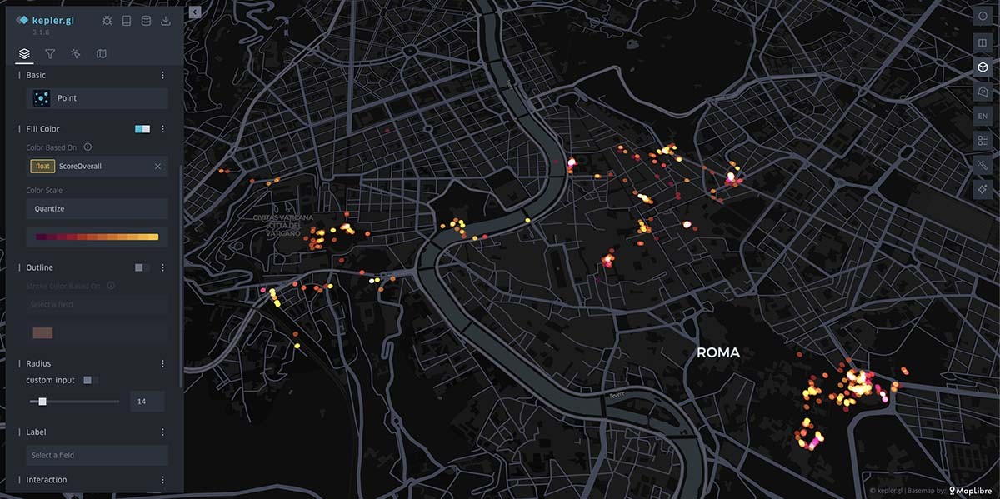

## About osxphotos-to-kepler
Script to extract metadata directly from the database used by the OSX Photos app so it can be visualised spatially and temporally in Kepler.gl



## Installation
1. Clone or download this project.
2. Install dependencies:
```sh
pip3 install -r requirements.txt 
```
3. Install exiftool: brew install exiftool
```sh
python3 brew install exiftool 
```
4. Run the scripts as described below:


## Default usage

```sh
python3 osxphotos-to-kepler.py "path to photos library"
```

Default mode outputs these metadata properties:
`Filename`  
`DateTime`
`Latitude`
`Longitude`

## Verbose use (slow)

Adding the `--verbose` flag will extract many more metadata properties.

```sh
python3 osxphotos-to-kepler.py "path to photos library" --verbose
```
Verbose mode outputs these metadata properties:
`UUID`   `Filename`   `OriginalFilename`   `Path`   `PathEdited`   `FileSize`  `FileFormat`   `MediaType`   `DateTime`   `DateAdded`   `DateModified`   `DateTrashed`   `TimezoneOffset`   `Latitude`   `Longitude`   `PlaceName`   `PlaceAddress`   `PlaceCountryCode`   `Title`   `Description`  `Keywords`   `Persons`   `Albums`   `Favorite`   `Hidden`   `Shared`   `Burst`   `BurstSelected`   `Live`   `Portrait`   `HDR`   `HasAdjustments`   `ScoreOverall`   `ScoreCuration`   `ScorePromotion`   `ScoreHighlight`   `ScoreAesthetic`   `ScoreContent`   `Moment`   `OriginalWidth`   `OriginalHeight`   `Width`   `Height`   `Orientation`   `IsCloud`   `InCloud`   `CloudStatus`   `ExternalEdit`   `Project`   `MetadataVersion`
